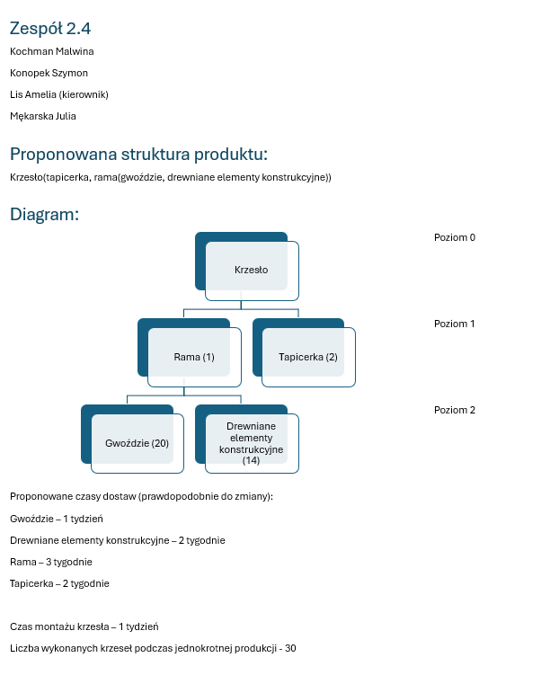

<<<<<<< HEAD
# Systemy zintegrowane 🪑

## Storage.json

### This is the data structure that the program uses to store the data.

- `initial_quantity`: is the quantity of the element that is available at the beginning of the simulation.
- `order_amount`: is the amount of items that are ordered.
- `waiting_time_in_weeks`: is the amount of weeks it takes to produce the item.
- `units_per_batch`: is the amount of items that are produced in one batch.
- `required_elements`: is the number of elements needed to produce one unit of the product
- `level`: is the level of the product in the BOM

## planned_orders.json

### array of objects with week and orders properties

## Materials

- `nails` 🪛
- `wooden_construction_elements` 🪵
- `frame` 🖼️
- `carpentry` 🛋️
- `chairs` 🪑
=======
# Krzesło

>>>>>>> 92352151cfd333877c8ddf9a9886f70ae09c90bd
